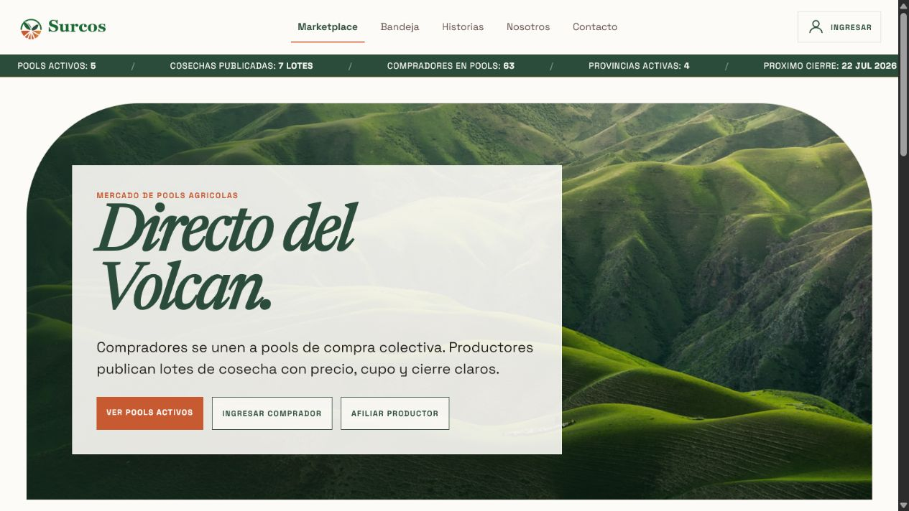
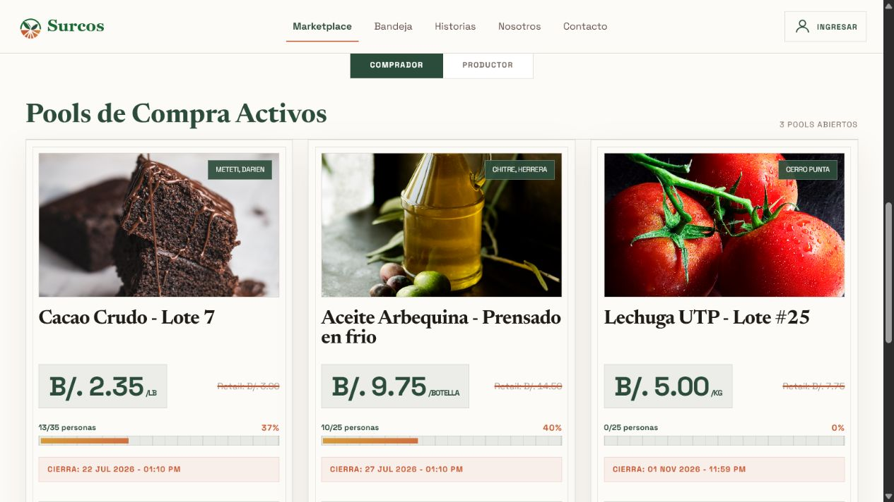
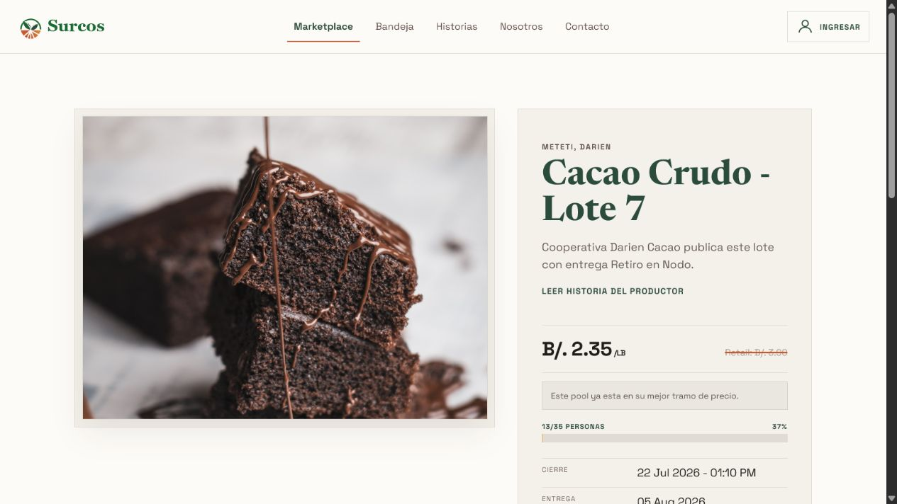
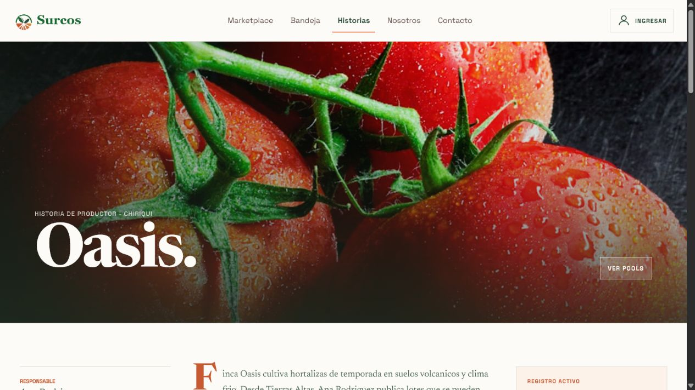
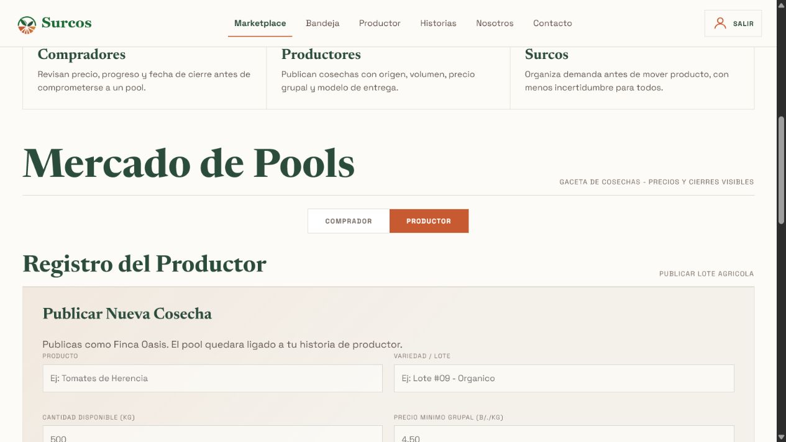
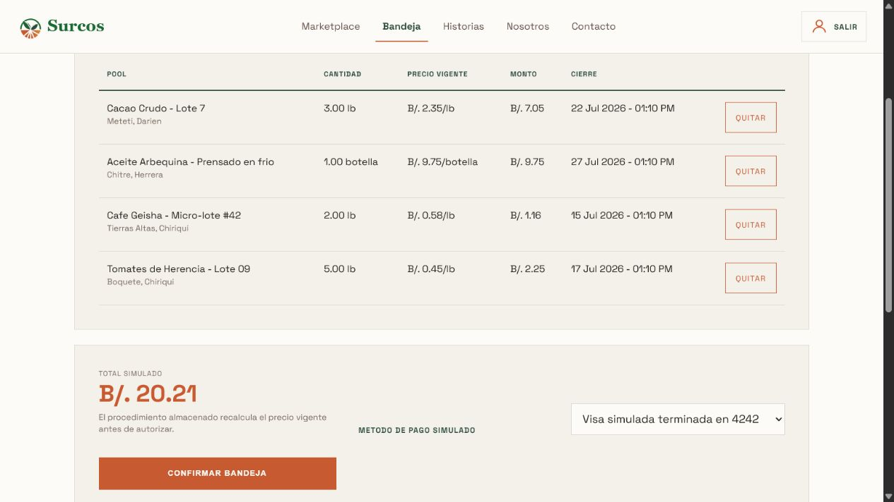
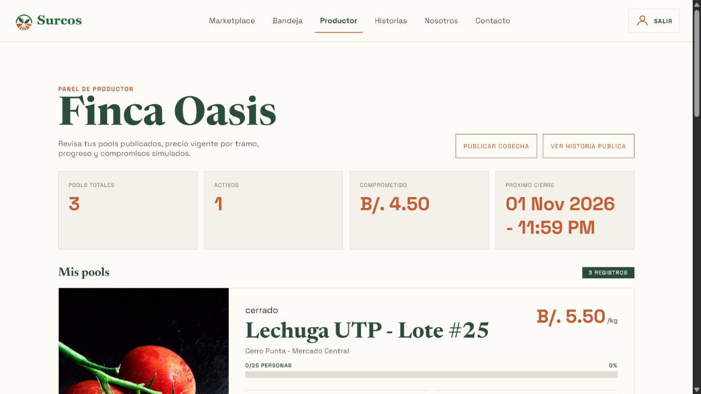

# Surcos

Surcos is a PHP/MySQL marketplace prototype for organized agricultural buying in Panama.

The product connects two sides of the workflow:

- Buyers compare agricultural lots, join purchase pools, and manage draft commitments.
- Producers publish harvest lots with origin, volume, price tiers, deadlines, and pickup rules.
- Administrators review access requests and manage the operational back office.

The interface is intentionally in Spanish because the product is designed around Panama's producers, buyers, and pickup nodes. This repository contains the working local demo, database seed, architecture notes, and verification docs.

> Scope note: Surcos is a demonstrable academic/portfolio prototype. Payments are simulated, and no real card data, email delivery, or production hosting is included.

## Product tour

<table>
  <tr>
    <td width="50%">
      
      <p><strong>Marketplace landing</strong><br><sub>Explains the product in one view and exposes active marketplace signals.</sub></p>
    </td>
    <td width="50%">
      
      <p><strong>Active purchase pools</strong><br><sub>Buyers compare product, location, price, progress, and closing date.</sub></p>
    </td>
  </tr>
  <tr>
    <td width="50%">
      
      <p><strong>Pool detail</strong><br><sub>A single lot brings together pricing, progress, delivery, pickup, and producer context.</sub></p>
    </td>
    <td width="50%">
      
      <p><strong>Producer story</strong><br><sub>Product origin and producer identity are part of the marketplace experience.</sub></p>
    </td>
  </tr>
  <tr>
    <td width="50%">
      
      <p><strong>Producer publication flow</strong><br><sub>Producers define lot details, pricing, quantity, location, pickup, and dates.</sub></p>
    </td>
    <td width="50%">
      
      <p><strong>Buyer basket</strong><br><sub>Draft commitments are reviewed together with current prices, closing dates, and simulated total.</sub></p>
    </td>
  </tr>
  <tr>
    <td width="50%">
      
      <p><strong>Producer dashboard</strong><br><sub>Producers can review their pools, active status, simulated commitments, and next closing date.</sub></p>
    </td>
    <td width="50%"></td>
  </tr>
</table>

## What the demo covers

### Buyer flow

1. Browse active pools from the marketplace.
2. Open a pool to review price, progress, closing date, delivery date, pickup node, and producer.
3. Add a quantity to the basket.
4. Confirm the basket with a simulated payment method.
5. Review the resulting activity in the pool history.

### Producer flow

1. Sign in as a producer.
2. Review published pools, price tiers, progress, and simulated commitments.
3. Publish a harvest lot with business rules and delivery details.
4. Connect the lot to a public producer story.

### Admin and API flow

- Review affiliation requests and their status history.
- Approve producer or buyer access with a temporary activation flow.
- Close expired pools through an explicit admin action.
- Read active pools, pool details, and producers through public JSON endpoints.

## Technical stack

- PHP 8.1+ with PDO
- MySQL/MariaDB
- HTML5 and CSS3
- Lightweight MVC architecture without an external framework
- PHP sessions and CSRF protection
- Stored procedures for pool commitment and closing logic
- REST/JSON web services

## Repository structure

```text
publico/                  Public document root and HTTP entrypoints
aplicacion/
  Controladores/           Request handling and flow coordination
  Modelos/                 PDO queries and business operations
  Vistas/                  Reusable PHP views
  Soporte/                 Sessions, CSRF, authentication, helpers
base_datos/                Schema, demo seed, marketplace migration, checks
docs/                      Demo script, QA evidence, delivery checklist
docs/screenshots/          High-quality screenshots used in this README
referencia_legacy/         Archived first prototype; not part of the official demo
```

## Run locally

### Requirements

- XAMPP, or PHP 8.1+ and MySQL/MariaDB installed separately
- Apache configured with `publico/` as the document root, or PHP's built-in server

### Setup

1. Copy the environment template:

   ```powershell
   Copy-Item .env.ejemplo .env
   ```

2. Set the local database values in `.env`:

   ```env
   MYSQL_HOST=127.0.0.1
   MYSQL_PORT=3306
   MYSQL_DATABASE=surcos
   MYSQL_USER=root
   MYSQL_PASSWORD=
   MOSTRAR_DETALLE_SALUD=false
   ```

3. Create the database and import the SQL files in order:

   ```text
   base_datos/001_esquema.sql
   base_datos/002_semillas_demo.sql
   base_datos/003_marketplace_real.sql
   ```

4. Start the local app from the repository root:

   ```powershell
   C:\xampp\php\php.exe -S 127.0.0.1:8000 -t publico
   ```

5. Open [http://127.0.0.1:8000/](http://127.0.0.1:8000/).

6. Run the demo data check when needed:

   ```powershell
   C:\xampp\mysql\bin\mysql.exe -u root surcos --batch --raw --execute="source C:/path/to/Surcos/base_datos/004_verificacion_demo.sql"
   ```

## Demo accounts

These accounts are intentionally part of the local seed for evaluation and portfolio review. They are not production credentials.

| Role | Email | Password |
| --- | --- | --- |
| Buyer | `comprador@surcos.pa` | `Surcos123!` |
| Producer | `productor@surcos.pa` | `Surcos123!` |
| Admin | `admin@surcos.pa` | `Admin123!` |

## Main routes

| Area | Route | Purpose |
| --- | --- | --- |
| Marketplace | `/` | Active pools and producer registration view |
| Pool | `/pool.php?id=grupo-cacao-07` | Public pool detail |
| Buyer | `/bandeja.php` | Draft commitments and simulated confirmation |
| Buyer | `/historial_pools.php` | Pool activity history |
| Producer | `/productor/` | Producer dashboard |
| Stories | `/historias_productor.php` | Producer stories linked to pools |
| Admin | `/admin/` | Administrator login and review tools |
| Health | `/salud.php` | Safe PHP, session, and database diagnostic |

### JSON endpoints

- `/api/pools.php`
- `/api/pool.php?id=grupo-cacao-07`
- `/api/productores.php`

## Architecture and security notes

- Public entrypoints live in `publico/`; application logic is separated into controllers, models, views, and support services.
- POST forms use CSRF tokens and backend validation.
- Database access uses prepared PDO statements.
- Passwords use `password_hash` and `password_verify`.
- HTML output is escaped before rendering.
- Sessions use `httponly` cookies and `SameSite=Lax`.
- Simulated payments store only fictitious last-four values and demo metadata; no full card number or CVV is collected.

## Verification

Useful project documents:

- [Product definition](PRODUCT.md)
- [Final demo walkthrough](docs/DEMO.md)
- [QA and rubric evidence](docs/QA.md)
- [Delivery checklist](docs/ENTREGA.md)
- [Database notes](base_datos/README.md)

Before pushing publicly, confirm that `.env`, PHP session files, and temporary screenshots outside `docs/screenshots/` are not tracked.

## Known limitations

- Payments are simulated rather than connected to a payment gateway.
- Email delivery and production deployment are out of scope.
- The API is REST/JSON; SOAP is not implemented.
- `referencia_legacy/` is retained as historical reference and is not the official application path.
